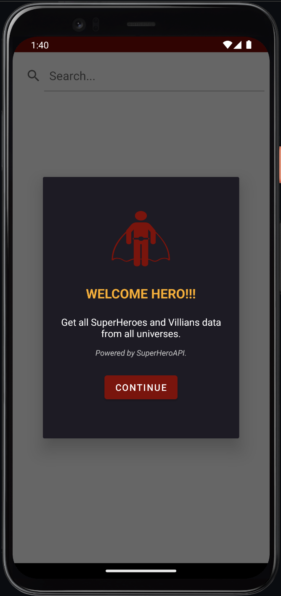
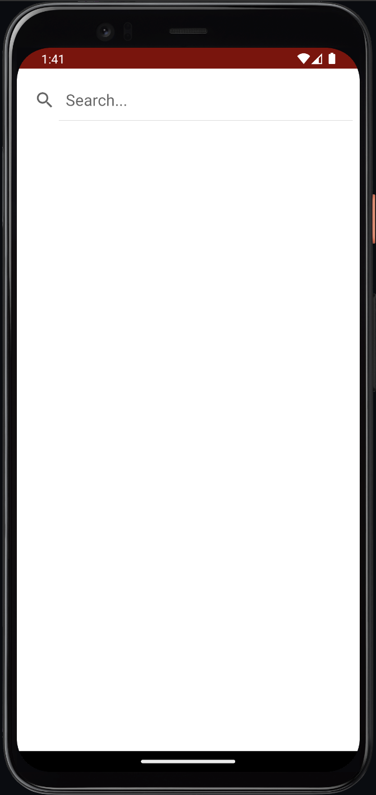
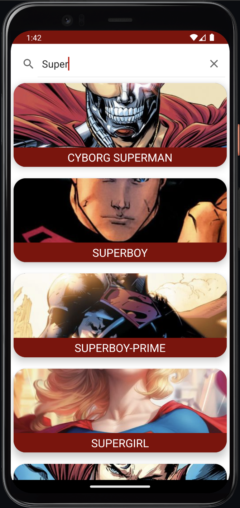
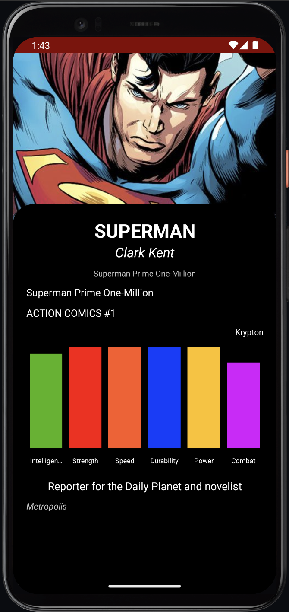
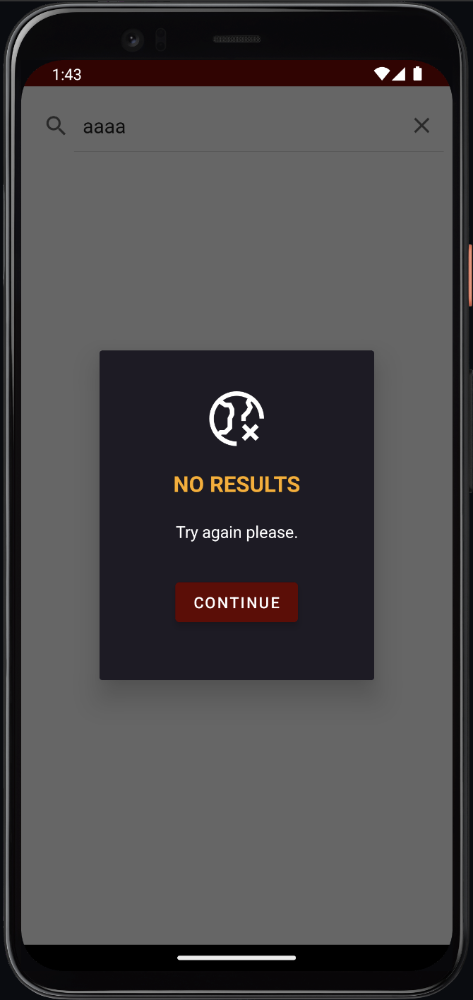

# Super Hero App

Super Hero App is an Android application developed in Kotlin that allows users to search for superheroes and view their details using the **SuperHero API**.

## Features
- 🔍 Search for superheroes by name.
- 📄 View detailed information about each superhero.
- 🖼️ Display superhero images using Picasso.
- ⚡ Powered by Retrofit for API requests.

## Tech Stack
- **Kotlin** - Main programming language.
- **Retrofit** - API communication.
- **Picasso** - Image handling.

## Installation
To set up the project on your local machine:

1. Clone the repository:
   ```sh
   https://github.com/FranciscoTxz/KotlinHeroApp.git
   ```
2. Open Android Studio and select **Open an Existing Project**.
3. Navigate to the cloned repository and open it.
4. Sync Gradle and install dependencies.
5. Run the application on an emulator or physical device.

## Usage
1. Install the app on an Android device.
2. Search for superheroes using the search bar.
3. Tap on a superhero to view detailed information.
4. If no results are found, an error screen will be displayed.

## Screenshots
- 🏠 Welcome Dialog

<p align="center">
   
</p>

- 🔍 Search Screen (Empty)

<p align="center">
   
</p>

- 📜 Search Screen (With Data)

<p align="center">
   
</p>

- 🦸‍♂️ Detail Screen

<p align="center">
   
</p>

- ❌ Try Again Dialog (Hero Not Found)

<p align="center">
   
</p>
